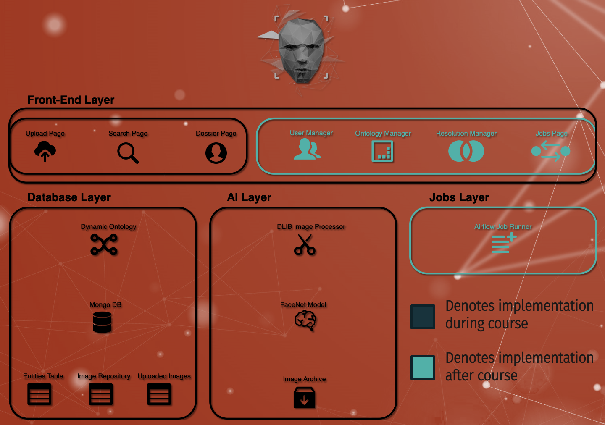
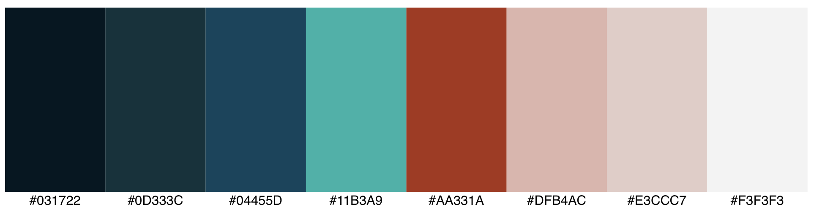

# Week 1 Homework

## [Github Project](https://github.com/jkruse8848/capstoneProjectKruse)

## Project Writeup

   - **SWOT Analysis**
   - **Definition statement**
     - I want to create an application that allows Law Enforcement Professionals to upload an image of someone involved in a crime and return matches to a person using facial recognition
   - **High level story**
     - Facial recognition is used across a wide variety of modern applications. Law Enforcement is significantly underserved in the technology space
   - **Outline of Content**
     - Home Page
     - Search Results Page
     - Dossier Page
     - Notifications Page
     - (Administrator) Jobs Page
     - (Administrator) User Manager Page
     - (Administrator) Resolution Page

**Architecture**

   - **User Flow**
       _(User Stories Listed in Terms of Priority)_
     - User Story 1
       - As a **USER** I want to be able to login and upload an image taken during a crime and return search results based on facial recognition
         - **Acceptance Criteria**
           - _User is able to login_
           - _User is able to find an upload option on the home page_
           - _User can drag and drop or open a file viewer to find the image_
           - _User can select an image for upload_
           - _User is able to view search results or receives a notification if no match is found_
           - _If no match is found, user can select option to receive update if future match is identified_
     - User Story 2
       - As a **USER** I want to be able to run a keyword search for a name or inmate number and return search results
         - **Acceptance Criteria**
           - _User is able to find search bar and enter numbers or keywords_
           - _User is able to view search results_
     - User Story 3
       - As a **USER** I want to be able to view a digestible dossier of any entity returned in my search results
         - **Acceptance Criteria**
           - _User is able to view basic biographic data of any entity in the application_
           - _User is able to view current address information of any entity in the application_
           - _User is able to view criminal history of any entity in the application_
           - _User is able to view a map that displays current address information_
### Additional users stories to be completed as time allows

     - User Story 4
       - As an **ADMINISTRATOR** I want to be able to manage user profiles in the application
         - **Acceptance Criteria**
           - _Administrator is able to add user profiles_
     - User Story 5
       - As an **ADMINISTRATOR** I want to be able to view the status of integration jobs that are pulling inmate data into the platform
         - _Administrator can view the current status of all scheduled jobs to include:_
           - _Completed_
           - _Running_
           - _Failed_
     - User Story 6
       - As an **ADMINISTRATOR** I want to be able to see entities that are likely the same and resolve them to improve model training over time
         - _Administrator can go to a page that shows likely similar entities and can either resolve or permanently reject the similarity_
         - _The system will update image repository to merge directories when matches are found across disparate systems_
   - **Wireframes**
     - Architecture Diagram

   - **Color pallet**

   - **Site navigation and Nav elements**
   - **Third Party APIs**
     - TensorFlow

