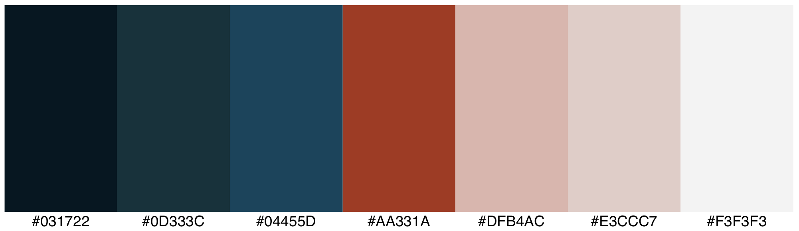

# Week 1 Homework

## [Github Project](https://github.com/jkruse8848/capstoneProjectKruse)

## Project Writeup

   - **SWOT Analysis**
   - **Definition statement**
     - I want to create an application that allows Law Enforcement Professionals to upload an image of someone involved in a crime and return matches to a person using facial recognition
   - **High level story**
     - Facial recognition is used across a wide variety of modern applications. Law Enforcement is significantly underserved in the technology space for a
   - **Outline of Content**
   - **User Flow**
       _User Stories Listed in Terms of Priority_
     - User Story 1
       - As a user I want to be able to login and upload an image taken during a crime and return search results based on facial recognition
         - Acceptance Criteria
           - User is able to login
           - User is able to find an upload option on the home page
           - User can drag and drop or open a file viewer to find the image
           - User can select an image for upload
           - User is able to view search results or receives a notification if no match is found
           - If no match is found, user can select option to receive update if future match is identified
     - User Story 2
       - As a user I want to be able to run a keyword search for a name or inmate number and return search results
         - Acceptance Criteria
   - **Wireframes**
   - **Color pallet**

   - **Site navigation and Nav elements**
   - **Third Party APIs**
     - TensorFlow

